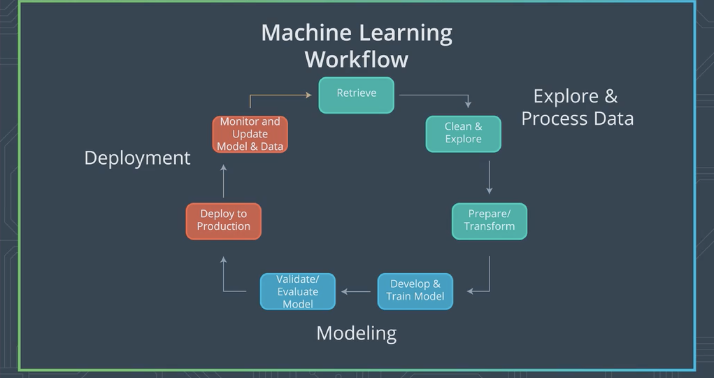
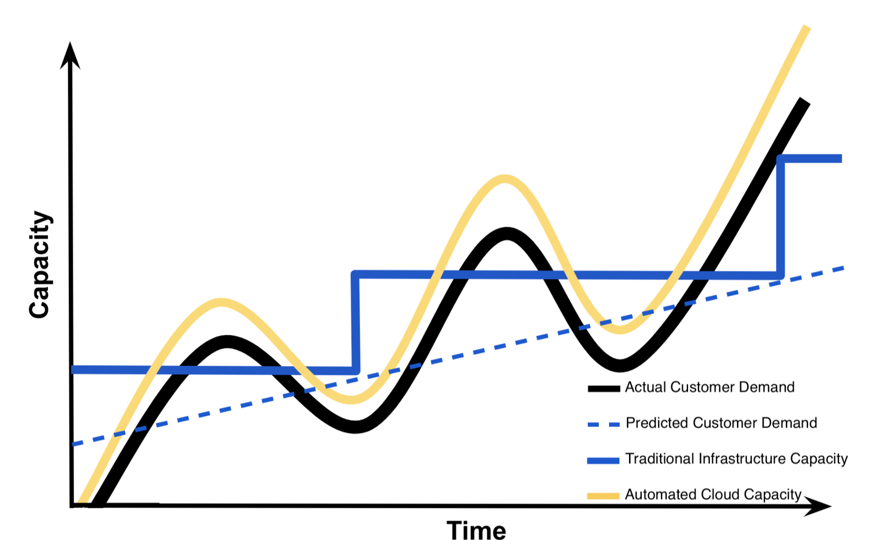
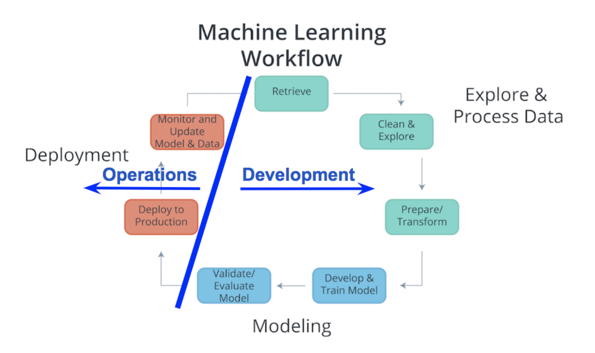
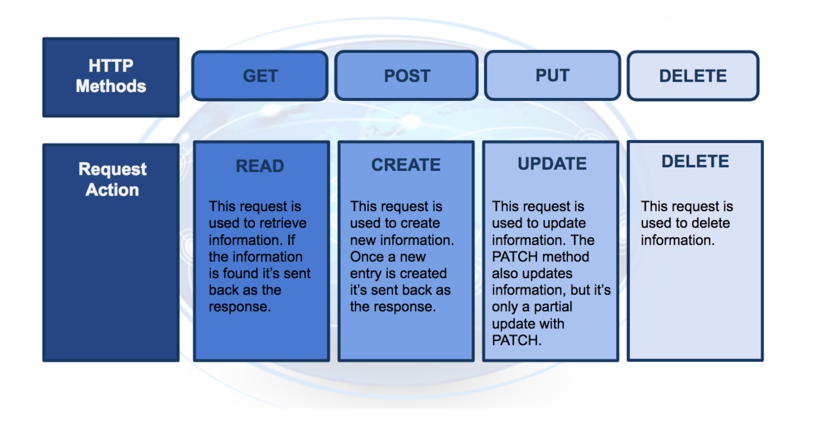
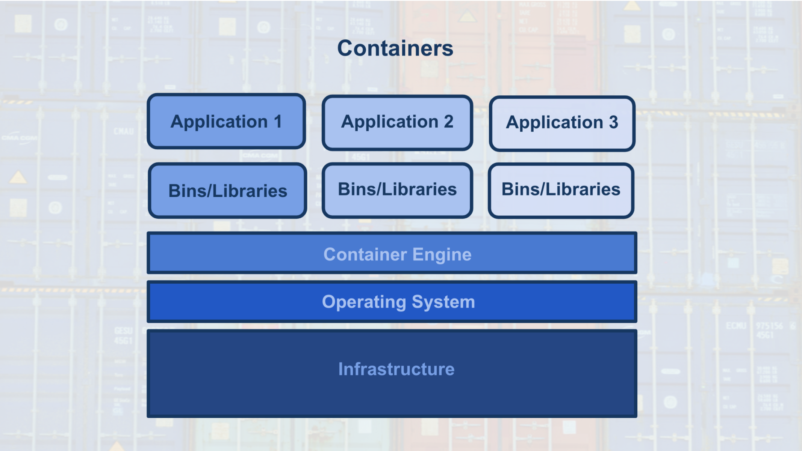

# Introduction

# Machine Learning Workflow

The Machine Learning workflow consist of mainly three different steps

1. Explore and Process the data
2. Modeling
3. Deployment

# Explore and Process the data

## Retrieve the data

This is the first step when we are planning to make a machine learning model. basically this involved getting the data to our environment in case of Kaggle dataset this is basically downloading the csv files.

## Clean and Explore the data

The data that we got might have some kind of noise it is necessary for us to clean our dataset so that such patterns are not learned by our model but rather useful information is.

This step also involves us going through the data to find thing like patterns that we can recognise.

## Prepare / Transform the data

Most machine learning models expect us to use standardised values so in this step we need to standardise the values and then transform the same so that it is easy for our model to understand and learn fast.

This step also involves splitting our dataset into training,validation and test datasets.

---

# Modeling

## Develop and Train the model

This step is where we put together our neural network and get everything working and then training the  said model.

## Validate / Evaluate the model

This step is where we use our validation dataset to validate our model and then use the test dataset to evaluate the model.

If we have developed more than one model in this step we would choose the once which is performing according to our use-case.

---

# Deployment

## Deploy the model to production

In this step we deploy our model into the cloud our locally to an app so that web or mobile applications can use our model to perform inference.

## Monitoring and Updating the model

If there is a tremendous change in our initial dataset the model should also perform accordingly in this step we update our model with the latest dataset so that this reflects on the applicaitons which are deployed also.

---

# Cloud Computing

In simple terms cloud computing can be thought of as transforming a IT product into an IT service.

Let us consider an example we can have lots of videos in a flash drive which we use in our home entertainment system. This flash drive is an IT product instead of using this media we can use something like Netflix or even have the video uploaded to icloud and access it from there these are called IT services.

The benefits of using cloud services are that if we have an internet it is easy to share files, can be accessed form anywhere given that we grant the required permissions.

Besides cloud storage there are other cloud based solutions like databases,virtual machines and other services like Sage Maker.

## Why do businesses use Cloud Computing

This has to do with the fact that businesses take into two things into consideration that is cost and time , Cloud services are very good at these things we can develop solutions in low cost as well as save some time while we are at it.

Looking at the graph we can understand that traditional infrastructures are not scaling in a smooth way how does this translate in real life one instance would be we wont have enough resources to support our customer base. Another might be we would have too much infrastructure but not as much customers as expected which would end up as us paying more for the resources than the expected income.

---

 

# Deployment to production

Ideally there are three ways to deploy a machine learning model

1. Python model is recoded into the programming language of the production environment.
2. Model is coded in Predictive Model Markup Language (PMML) or Portable Format Analytics (PFA).
3. Python model is converted into a format that can be used in the production environment.

These are mentioned form the once that are least used to the once that are most used

The first method is to rewrite the model we have made in python to the language the that is used by the environment we are deploying to is using usually c++ or python but this is too much intense since lot of time would be wasted on coding this and also to update the model would take the same amount of work.

The second method is to code the model in Predictive Model Markup Language (PMML) or Portable Format for Analytics (PFA), which are two complementary standards that simplify moving predictive models to deployment into a production environment.

The third and most commonly used method is to use the the libraries we have to convert the model to intermediate state which can be then again converted to software native to the production environment.

---

## ML Ops

In the past the machine learning workflow used to be divided to two session Development and Operation. The Development session used to be taken care of by the analyst while the operations part used to be taken care of by software development but the recent advancements in technologies like containers and REST APIs allowed analyst to deploy models into produciton.

---

# Production environment

When we are providing a AI powered service the the user there are these factors we consider,

The user sends the data to the application the application send the data to the model and the model processes this data and sends the prediction back to the application where the user read the output.

The Application in this case is our production environment.

---

## EndPoints

In the above diagram the Endpoint is defined as an interface to the model.

The interface allows ease of communication to the model to receive data and to send prediction back.

One way to think about this is like a function in a python program

The function call is the endpoint.

The function is the model and

The python program can be considered as the application.

---

## EndPoints and REST API

The communication between the Application and the Model is done through EndPoint what the endpoint in practice an Application Programming Interface or API in short.

API can be thought of as a set of rules that allow Applications to communicate to the model with a set of rules.

In our case we use Representative State Transfer or REST architecture, that provides a framework for the set of rules and constraints that must be adhered to for communication between programs.

REST API uses http request to establish communication between the model and application through endpoints.

http request and http response are send between the application and the model.

The https request consist of four parts

**endpoints**

This endpoints will be in the form of a URL (Uniform Resource Locator) which is commonly is the form of a web address

**http method**

there are four kinds of method each to do a specific task

**http headers**

The headers will contain additional information, like the format of the data within the message, that’s passed to the receiving program.

**message**

The final part is the message (data or body); for deployment will contain the user’s data which is input into the model.

The http response also contains three parts this is send from the model to our applicaiton

**http status code**

If the model successfully received and processed the user’s data that was sent in the message, the status code should start with a 2, like 200.

**https headers**

The headers will contain additional information, like the format of the data within the message, that’s passed to the receiving program.

**Message**

What’s returned as the data within the message is the prediction that’s provided by the model.

While using RESTful APIs it is the applications responsibility to convert the http request in the format that can be understood by the Endpoint as well as convert the http response to a format that is understood by the application.

- Often *user's data* will need to be in a *CSV* or *JSON* format with a specific *ordering* of the data that's dependent upon the **model** used.
- Often *predictions* will be returned in *CSV* or *JSON* format with a specific *ordering* of the returned *predictions* dependent upon the **model** used.

---

# Containers

As discussed above the model and application in the production require a environment to run on.

These environments are called containers.

The containers are created using a script that contains instructions on which software packages, libraries, and other computing attributes are needed in order to run a software application, in our case either the model or the application.

Container can be thought of as a bundle/collection of software that is used for the specific purpose for running an application

In our case we would be setting up container which is to be running dependencies for running our machine learning inference.

The advantages of using docker is that

1. Isolates the application, which *increases* security. 
2. Requires *only* software needed to run the application, which uses computational resources *more efficiently* and allows for faster application deployment. 
3. Makes application creation, replication, deletion, and maintenance easier and the same across all applications that are deployed using containers. 
4. Provides a more simple and secure way to replicate, save, and share containers. 

---

# Building a model using Sage Maker

# What is Sage Maker

sage maker is a combination of 

1. A managed Jupyter notebook 
2. Application Programming Inference

---

# Why use Sage Maker

The sage maker provides a platform where we can combine both the development as well as deployment steps while making a ML powered application.

The notebook will help us explore the data and transform everything to the required format.

The API will help us the modeling and deployment steps.

---

## The Sage Maker API

The sage maker API can be thought of as a collection of tools that can help with both the training as well as the inference process.

Lets consider training the model for this process a computational task is performed in this case that is fitting a model to a dataset. This task is performed in a virtual machine. The trees constructed in a random tree model or the layers in a neural network is saved to a file this file is called model artifacts.

While performing an inference our computational task is to perform inference the inference engine takes in the model artifacts and wait for the user to input data and performs inference.

---

## Examples

[Boston Housing XGBoost(BatchTransform) High Level](https://github.com/abhijitramesh/deploying_ml_models/blob/master/Boston%20Housing%20-%20XGBoost%20(Batch%20Transform)%20-%20High%20Level.ipynb)

This notebook contains a notebook which is a sample on how a simple classification can be run on sagemaker.

[Sentiment analysis using XGBoost](https://github.com/abhijitramesh/deploying_ml_models/blob/master/IMDB%20Sentiment%20Analysis%20-%20XGBoost%20(Batch%20Transform).ipynb)

[Boston Housing XGBoost Low Level](https://github.com/abhijitramesh/deploying_ml_models/blob/master/Boston%20Housing%20-%20XGBoost%20(Batch%20Transform)%20-%20Low%20Level.ipynb)

This notebook contains the same classification as the high level but here we are taking a look at what is happening behind in sagemaker.

[Boston Housing Deployment High Level](https://github.com/abhijitramesh/deploying_ml_models/blob/master/Boston%20Housing%20-%20XGBoost%20(Deploy)%20-%20High%20Level.ipynb)

This notebook contains information about deploying a model to an endpoint using the high level APIs.

[Boston Housing Deployment Low Level](https://github.com/abhijitramesh/deploying_ml_models/blob/master/Boston%20Housing%20-%20XGBoost%20(Deploy)%20-%20Low%20Level.ipynb)

## Deploying a model using AWS

Here we are using a model build in Amazon SageMaker and using SageMaker to initialize the EndPoint.

AWS Lambda is used to create a function that can use our model for inference.

API Gateway is set which uses our Lambda Function so that applications can communicate with our Model for inference.

[Movie Sentiment Analysis Webapp deplyment](https://github.com/abhijitramesh/deploying_ml_models/blob/master/IMDB%20Sentiment%20Analysis%20-%20XGBoost%20(Batch%20Transform).ipynb)

## Hyper-parameter Tuning

When we are training a model usually we specify some hyperparameters but in most cases this wont be the most ideal hyper-parameters so AWS offers a neat feature called hyperparameter tuning which allowed us to set a particular range of hyperparameters and also tell how we expect the model to perform and sagemaker will determine the best performing model and return it to us.

